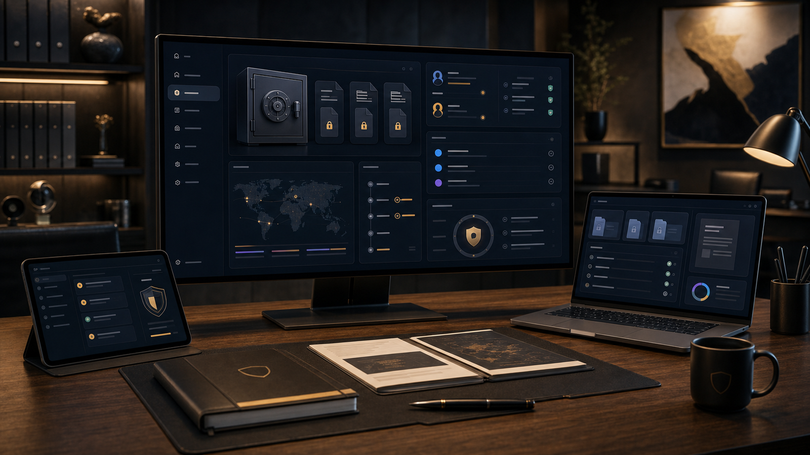

# SAM Dossier - Portfolio Case Study

**Live artifact:** [https://sam-dossier.vercel.app/](https://sam-dossier.vercel.app/)  
**Portfolio role:** Mining investment dossier, stakeholder dashboard, document workflow  
**Source posture:** Sanitized public case study for a controlled-access platform.

_Generated portfolio visual; not a confidential product screenshot._

## Overview

SAM Dossier is a controlled-access platform concept for mining investment workflows, stakeholder reporting, document access, project tracking, and dashboard-based decision support.

## My Role

I shaped the public case-study framing, information architecture, workflow model, and dashboard concepts while keeping confidential investment and operational material separated from public review.

## What This Demonstrates

- Stakeholder dashboard architecture.
- Role-based workspace and document workflow thinking.
- Investor-dossier information architecture.
- Financial model interface planning and project-board concepts.
- Security-conscious separation between public proof and protected production context.

## Technical Proof

- **Stack and delivery signals:** Controlled-access product framing, dossier information architecture, stakeholder dashboard modeling, document workflow planning, and privacy-aware public disclosure.
- **Public evidence:** Login-gated shell, role-based workspace concept, document workflow framing, and confidentiality boundary around investor material.
- **Confidentiality boundary:** This public repo avoids investor records, private documents, financial assumptions, credentials, user data, document-vault contents, and operational mining details.

## Public Review Context

The login-gated live shell presents the public controlled-access surface. This case study adds architecture and workflow context. The [NWhite Systems Portfolio](https://github.com/whitemorengwira/nwhitesystems) and [one-page recruiter PDF](https://github.com/whitemorengwira/nwhitesystems/blob/main/docs/assets/recruiter-pack/Whitemore-Ngwira-Selected-Systems-Portfolio.pdf) provide broader hiring-review context.

## 90-Second Evidence Route

- Live shell for the public controlled-access surface.
- `My Role`, `What This Demonstrates`, and `Technical Proof` for architecture and delivery context.
- Wider [recruiter review guide](https://github.com/whitemorengwira/nwhitesystems/blob/main/docs/recruiter-review-guide.md) for confidentiality and portfolio context.
- [Portfolio walkthrough request](mailto:hello@nwhite.systems?subject=Portfolio%20walkthrough%20-%20SAM%20Dossier) for deeper review where permission allows.

## Confidentiality

This repository does not publish investor records, private documents, financial assumptions, credentials, user data, document-vault contents, or operational mining details. Deeper walkthroughs can be provided privately where confidentiality allows.

## Usage Rights

This repository is public for portfolio review only and is not open-source licensed. See [COPYRIGHT.md](COPYRIGHT.md) for usage boundaries.

## Contact

- Portfolio: https://nwhite.systems
- GitHub showcase: https://github.com/whitemorengwira/nwhitesystems
- Professional contact: [hello@nwhite.systems](mailto:hello@nwhite.systems?subject=Portfolio%20walkthrough%20-%20SAM%20Dossier)
